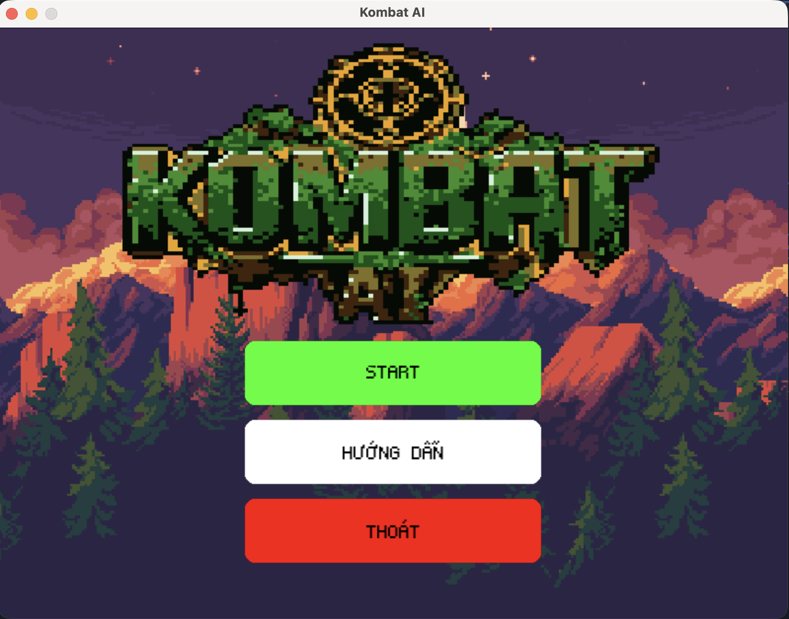
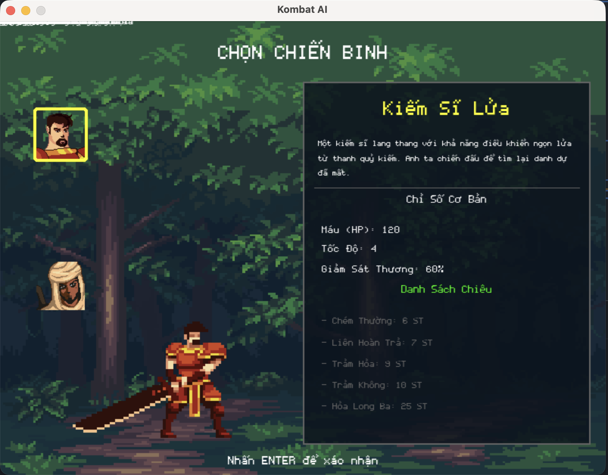
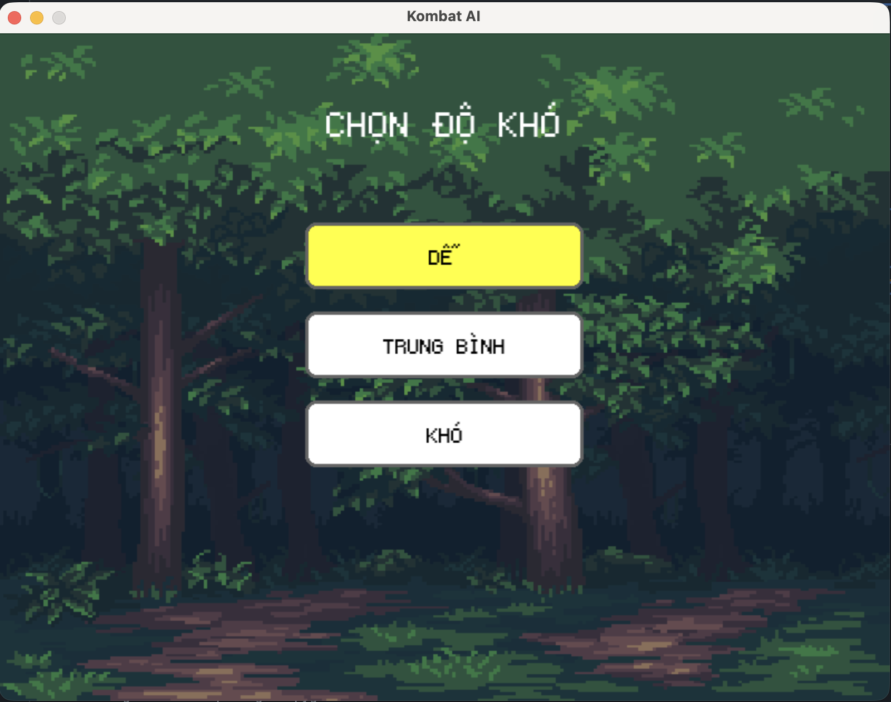
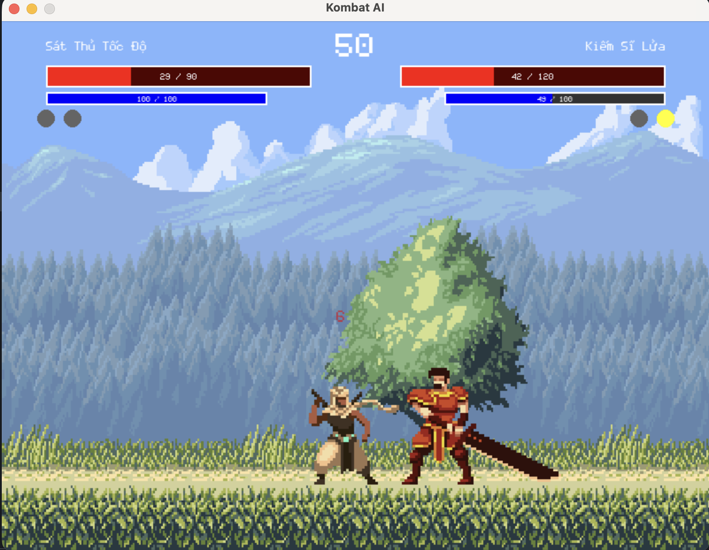
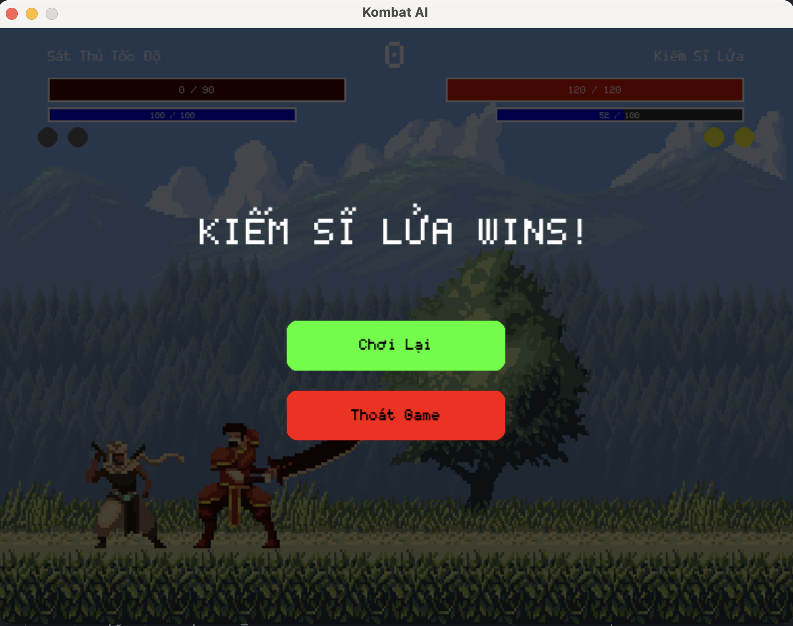

# ⚔️ Kombat AI: Game Đối Kháng Pygame với Hệ Thống AI Đa Cấp
[](https://opensource.org/licenses/MIT)
[](https://www.python.org/)
[](https://www.pygame.org/)

Một game đối kháng 2D được xây dựng bằng Python và Pygame, nơi người chơi đối đầu với một hệ thống AI đa cấp độ, từ hành vi ngẫu nhiên đến khả năng học hỏi và thích ứng với chiến thuật của người chơi.

## 🌟 Tổng quan dự án

Dự án này được sinh ra từ ý tưởng tạo ra một trải nghiệm game đối kháng single-player có chiều sâu. Vấn đề cốt lõi mà dự án giải quyết là tạo ra một đối thủ AI đủ thông minh và thử thách để người chơi không cảm thấy nhàm chán. Để giải quyết điều này, chúng tôi đã phát triển một hệ thống AI 3 cấp độ, với cấp độ cao nhất có khả năng ghi nhớ, phân tích và dự đoán hành vi của người chơi để đưa ra phản công.

Thông qua việc xây dựng dự án này, chúng tôi đã nâng cao kỹ năng lập trình game, thiết kế hệ thống AI, quản lý trạng thái game, và tối ưu hóa hiệu năng trong Pygame. Dự án đã dạy chúng tôi tầm quan trọng của việc xây dựng một cấu trúc mã nguồn có tổ chức (OOP) và cách mô phỏng hành vi thông minh thông qua các thuật toán heuristic.

## 🚀 Công nghệ sử dụng

*   **Ngôn ngữ:** Python 3
*   **Thư viện:** Pygame
*   **Kiến trúc:** Lập trình hướng đối tượng (OOP)
*   **Công cụ phát triển:**
    *   **IDE:** Visual Studio Code
    *   **Quản lý phiên bản:** Git

## ✨ Các tính năng chính

#### 🔍 1. Hệ thống chiến đấu 1v1 cổ điển

*   **Cơ chế HP & SP:** Quản lý Máu để sống sót và Năng lượng để sử dụng kỹ năng.
*   **Chuỗi Combo:** Thực hiện chuỗi 3 đòn tấn công thường để tối đa hóa sát thương.
*   **Chiêu đặc biệt:** Mỗi nhân vật có một kỹ năng độc đáo, uy lực cao.
*   **Không chiến:** Tấn công và di chuyển linh hoạt trên không, bao gồm cả nhảy đôi.

#### 👤 2. Hai nhân vật với lối chơi độc đáo

*   **Kiếm Sĩ Lửa:** Sức mạnh vượt trội, máu trâu, phòng thủ tốt nhưng tốc độ chậm.
*   **Sát Thủ Tốc Độ:** Tốc độ cao, combo nhanh nhưng máu giấy và phòng thủ yếu.

Mỗi nhân vật có bộ chỉ số, kỹ năng và hoạt ảnh riêng biệt được định nghĩa trong file cấu hình, cho phép tạo ra các trận đấu với nhiều chiến thuật khác nhau.

#### 🤖 3. Hệ thống AI đa cấp độ

*   **Dễ (Random):** AI thực hiện các hành động một cách hoàn toàn ngẫu nhiên, là thử thách khởi đầu cho người chơi mới.
*   **Trung bình (Rule-Based):** AI hành động dựa trên một bộ luật định sẵn (VD: "Nếu người chơi ở gần, hãy tấn công").
*   **Khó (Heuristic):** AI có khả năng phỏng đoán hành động của người chơi, giữ khoảng cách và chọn thời điểm tấn công hợp lý. Nó có thể học và phản công dựa trên thói quen của bạn.

#### 🛡️ 4. Cơ chế chiến đấu nâng cao

*   **Đỡ đòn (Block):** Giảm sát thương nhận vào và hồi SP khi đỡ đòn thành công.
*   **Lướt né & I-Frames:** Lướt né để có một khoảng thời gian ngắn (200ms) bất tử, giúp né tránh các đòn tấn công chí mạng.
*   **Phản xạ lướt (Tech Roll):** Kỹ năng phòng thủ cao cấp, cho phép lướt đi ngay sau khi bị đánh trúng để thoát khỏi combo của đối thủ.

#### ❤️ 5. Vòng lặp game hoàn chỉnh

*   **Menu & Hướng dẫn:** Giao diện menu chính, màn hình hướng dẫn chi tiết cho người chơi mới.
*   **Hệ thống hiệp đấu:** Thể thức đấu 3 thắng 2 (Best of 3) với đồng hồ đếm ngược.
*   **Màn hình kết quả:** Màn hình Game Over công bố người chiến thắng và cho phép chơi lại.

## 🏗️ Kiến trúc & Thiết kế

#### Nguyên tắc thiết kế chính

*   **Lập trình hướng đối tượng (OOP):**
    *   `Fighter Class`: Một lớp duy nhất quản lý toàn bộ trạng thái và hành động cho cả người chơi và AI, giúp tái sử dụng code tối đa.
    *   `Game Class`: Lớp quản lý chính, điều khiển vòng lặp game, các trạng thái (menu, in-game, game over), và sự kiện.
*   **Quản lý trạng thái (State Management):** Sử dụng một biến `game_state` để kiểm soát luồng hoạt động của ứng dụng, từ menu chính đến màn hình chọn nhân vật và trận đấu.
*   **Thiết kế dựa trên cấu hình (Configuration-Driven):** Toàn bộ chỉ số nhân vật, thông số game (máu, tốc độ, sát thương) được lưu trong file `config.py`, giúp dễ dàng chỉnh sửa, cân bằng game mà không cần thay đổi mã nguồn logic.

#### Lợi ích đạt được

*   **Dễ bảo trì & Mở rộng:** Cấu trúc module hóa giúp việc sửa lỗi, thêm nhân vật mới hoặc tích hợp một thuật toán AI mới trở nên đơn giản.
*   **Linh hoạt:** Dễ dàng tinh chỉnh các thông số game để tạo ra các trải nghiệm khác nhau.
*   **Tái sử dụng cao:** Logic của lớp `Fighter` được áp dụng cho cả người chơi và AI.

## 📊 Kết quả và bài học kinh nghiệm

#### Kỹ năng kỹ thuật đã phát triển:

*   **Phát triển Game với Pygame:** Nắm vững vòng lặp game, xử lý input, hoạt ảnh (animation), và âm thanh.
*   **Thiết kế hướng đối tượng:** Áp dụng các nguyên tắc OOP để xây dựng một hệ thống có cấu trúc rõ ràng, dễ mở rộng.
*   **Logic AI cơ bản:** Hiểu và hiện thực hóa được các thuật toán AI từ đơn giản đến phức tạp trong môi trường thực tế.
*   **Quản lý trạng thái:** Kinh nghiệm trong việc điều khiển các trạng thái khác nhau của một ứng dụng phức tạp.

#### Bài học quan trọng:

*   **Tầm quan trọng của kiến trúc:** Việc đầu tư thời gian vào thiết kế cấu trúc ban đầu giúp quá trình phát triển và bảo trì sau này dễ dàng hơn rất nhiều.
*   **Tách biệt dữ liệu và logic:** Việc sử dụng file `config.py` là một bài học quý giá về việc giữ cho mã nguồn logic sạch sẽ và linh hoạt.
*   **AI không chỉ là thuật toán:** Để AI "thật" hơn, cần kết hợp logic với các yếu tố như thời gian trễ, xác suất ngẫu nhiên để mô phỏng hành vi của con người.

## 🚦 Bắt đầu

#### Yêu cầu

*   Python 3.7+
*   Pygame (`pip install pygame`)

#### Các bước cài đặt

1.  **Clone repository**
    ```bash
    git clone https://github.com/gameAI-group/KOMBAT_AI_PROJECT.git
    cd KOMBAT_AI_PROJECT
    ```

2.  **Cài đặt thư viện**
    ```bash
    pip install pygame
    ```

3.  **Chạy game** *(Giả sử file chính của bạn là `main.py` hoặc tương tự)*
    ```bash
    python main.py
    ```

## 📱 Ảnh chụp màn hình

| Trang chủ | chọn và thông tin nhân vật Kiếm Sĩ |
| :---: | :---: |
|  |  |

|  chọn và thông tin nhân vật Sát Thủ | Chọn mức độ |
| :---: | :---: |
|  |  |

| Giao diện trận đấu | Màn hình Kết thúc |
| :---: | :---: |
|  |  |


## 🙏 Lời Cảm Ơn & Ghi Nhận Tác Giả

Dự án này sẽ không thể có được diện mạo chuyên nghiệp và sống động nếu thiếu đi sự đóng góp từ những nhà sáng tạo tài năng và hào phóng trong cộng đồng. Chúng tôi xin trân trọng ghi nhận và gửi lời cảm ơn sâu sắc nhất đến:

*   **Hoạt ảnh Nhân vật** bởi nghệ sĩ **[chierit](https://chierit.itch.io/)** trên itch.io:
    *   Nhân vật A (Kiếm Sĩ Lửa): [Elementals - Fire Knight](https://chierit.itch.io/elementals-fire-knight)
    *   Nhân vật B (Sát Thủ Tốc Độ): [Elementals - Wind Hashashin](https://chierit.itch.io/elementals-wind-hashashin)

*   **Hình nền (`backgrounds`)** bởi nghệ sĩ **[ansimuz](https://ansimuz.itch.io/)** trên itch.io:
    *   Bộ sưu tập: [Gothicvania Patreon Collection](https://ansimuz.itch.io/gothicvania-patreon-collection)

*   **Âm thanh & Nhạc nền** (`audio`): Được tổng hợp từ nhiều nguồn cung cấp tài sản miễn phí (royalty-free) khác nhau trên internet.

---

❤️ **Hãy cùng nhau ủng hộ những nhà sáng tạo tuyệt vời này!**

Chúng tôi thực sự ngưỡng mộ tài năng và sự tận tâm được thể hiện trong từng tác phẩm. Việc họ chia sẻ miễn phí tài nguyên chất lượng cao chính là điều kiện tiên quyết giúp những dự án độc lập như thế này có thể thành hình.

Nếu bạn cũng yêu thích phong cách nghệ thuật của game, chúng tôi khuyến khích bạn ghé thăm trang của họ. Mỗi lượt theo dõi, lời bình luận tích cực hay việc mua một tài sản trả phí đều là nguồn động lực to lớn giúp họ tiếp tục sáng tạo và cống hiến cho cộng đồng.

---

## 🔮 Các cải tiến trong tương lai

*   **Thêm nhân vật mới:** Mở rộng danh sách chiến binh với các bộ kỹ năng đa dạng hơn.
*   **AI học máy:** Tích hợp các mô hình Reinforcement Learning để AI có thể tự học và cải thiện qua mỗi trận đấu.
*   **Chế độ chơi 2 người (Player vs Player):** Cho phép hai người chơi trên cùng một máy tính.
*   **Hỗ trợ tay cầm (Controller):** Thêm khả năng điều khiển bằng gamepad.
*   **Thêm các sàn đấu (Stages):** Mỗi sàn đấu có thể có các đặc điểm riêng.

## 🤝 Đóng góp

Mọi sự đóng góp đều được chào đón! Vui lòng tạo một Pull Request để gửi các thay đổi của bạn. Đối với các thay đổi lớn, hãy mở một Issue trước để chúng ta có thể thảo luận.

## 📄 Giấy phép

Dự án này được cấp phép dưới Giấy phép MIT - xem file `LICENSE` để biết thêm chi tiết.

## 📞 Liên hệ

*   [@Chizk23](https://github.com/Chizk23) - Nguyễn Thanh Huyền
*   [@BichUyen2609](https://github.com/BichUyen2609) - Nguyễn Thị Bích Uyên
*   [@PhuongTran2212](https://github.com/PhuongTran2212) - Trần Thị Phượng