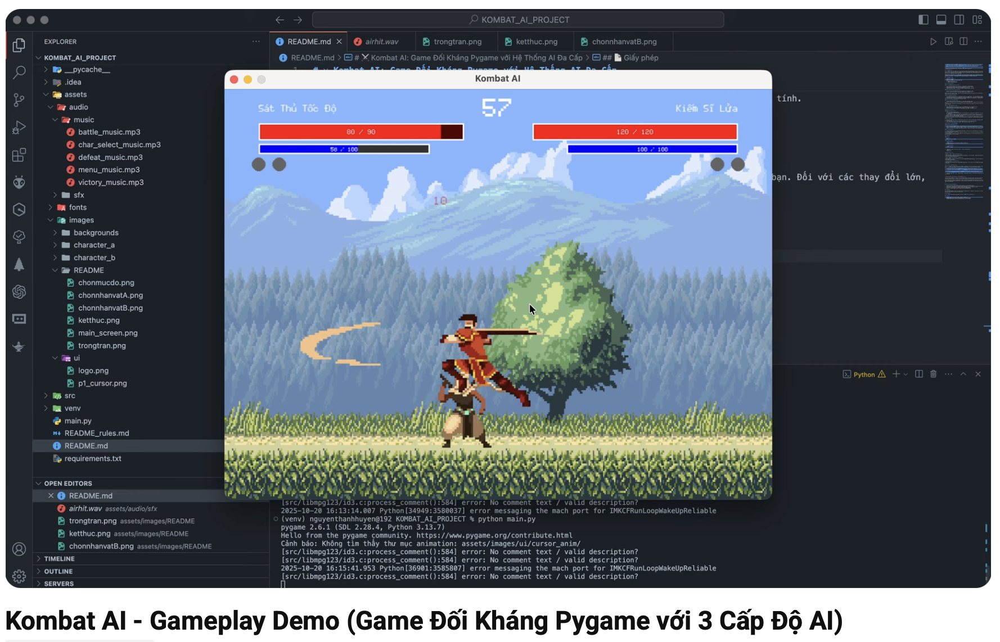

# ⚔️ Kombat AI: A Pygame Fighting Game with a Multi-Level AI System

[](https://opensource.org/licenses/MIT)
[](https://www.python.org/)
[](https://www.pygame.org/)

A 2D fighting game built with Python and Pygame, where players face a multi-level AI system, ranging from random behavior to learning and adapting to player tactics.

## 🌟 Project Overview

This project was born from the idea of creating a single-player fighting game experience with depth. The core problem it solves is creating an AI opponent that is intelligent and challenging enough to keep players engaged. To address this, we developed a 3-level AI system, with the highest level capable of remembering, analyzing, and predicting the player's behavior to launch counter-attacks.

Through building this project, we enhanced our skills in game development with Pygame, AI system design, game state management, and performance optimization. This project taught us the importance of a well-organized codebase (OOP) and how to simulate intelligent behavior using heuristic algorithms.

## 🎬 Gameplay Demo

Click the image below to watch a full video showcasing the project's features and gameplay!

[](https://youtu.be/YVVdls7yBd0)

## 🚀 Technologies Used

*   **Language:** Python 3
*   **Library:** Pygame
*   **Architecture:** Object-Oriented Programming (OOP)
*   **Development Tools:**
    *   **IDE:** Visual Studio Code
    *   **Version Control:** Git

## ✨ Key Features

#### 🔍 1. In-depth 1v1 Fighting System

*   **HP & SP Mechanics:** Manage Health to survive and Stamina to use skills.
*   **Combo Chains:** Execute 3-hit normal attack combos to maximize damage.
*   **Special Moves:** Each character has a unique and powerful special move.
*   **Aerial Combat:** Attack and move flexibly in the air, including double jumps.

#### 👤 2. Two Unique Characters

*   **Fire Knight:** Superior strength, high health, and good defense, but slow.
*   **Wind Hashashin:** High speed and fast combos, but has low health and weak defense.

Each character has a distinct set of stats, skills, and animations defined in the configuration file, allowing for a variety of strategic matchups.

#### 🤖 3. Multi-Level AI System

*   **Easy (Random):** The AI performs actions completely randomly, serving as an initial challenge for new players.
*   **Medium (Rule-Based):** The AI follows a predefined set of rules (e.g., "If the player is close, attack").
*   **Hard (Heuristic):** The AI can predict player actions, maintain optimal distance, and choose the right moment to attack. It can learn and counter based on your habits.

#### 🛡️ 4. Advanced Combat Mechanics

*   **Blocking:** Reduce incoming damage and regain SP on a successful block.
*   **Dodging & I-Frames:** Dodge to gain a short period of invincibility (200ms) to avoid critical attacks.
*   **Tech Roll:** An advanced defensive skill that allows you to roll away immediately after being hit to escape combos.

#### ❤️ 5. Complete Game Loop

*   **Menu & Tutorial:** A main menu and a detailed guide screen for new players.
*   **Round System:** A "Best of 3" format with a round timer.
*   **Results Screen:** A Game Over screen that announces the winner and allows for a rematch.

## 🏗️ Architecture & Design

#### Key Design Principles

*   **Object-Oriented Programming (OOP):**
    *   `Fighter Class`: A single class manages all states and actions for both the player and the AI, maximizing code reusability.
    *   `Game Class`: The main class that controls the game loop, states (menu, in-game, game over), and events.
*   **State Management:** A `game_state` variable is used to control the application flow, from the main menu to character select and the fight itself.
*   **Configuration-Driven Design:** All character stats and game parameters (health, speed, damage) are stored in `config.py`, making it easy to edit and balance the game without changing the core logic.

#### Benefits Achieved

*   **Easy to Maintain & Extend:** The modular structure makes it simple to fix bugs, add new characters, or integrate new AI algorithms.
*   **Flexible:** Game parameters can be easily tweaked to create different experiences.
*   **Highly Reusable:** The logic of the `Fighter` class is applied to both the player and the AI.

## 📊 Outcomes & Lessons Learned

#### Technical Skills Developed:

*   **Game Development with Pygame:** Mastered the game loop, input handling, animations, and sound.
*   **Object-Oriented Design:** Applied OOP principles to build a well-structured and scalable system.
*   **Basic AI Logic:** Understood and implemented AI algorithms from simple to complex in a real-world environment.
*   **State Management:** Gained experience in managing different states of a complex application.

#### Key Takeaways:

*   **The Importance of Architecture:** Investing time in initial design makes future development and maintenance significantly easier.
*   **Separation of Data and Logic:** Using a `config.py` file is a valuable lesson in keeping the core logic clean and flexible.
*   **AI is More Than Just Algorithms:** To make an AI feel more "human," logic must be combined with elements like delays and randomness.

## 🚦 Getting Started

#### Prerequisites

*   Python 3.7+
*   Pygame (`pip install pygame`)

#### Installation Steps

1.  **Clone the repository**
    ```bash
    git clone https://github.com/gameAI-group/KOMBAT_AI_PROJECT.git
    cd KOMBAT_AI_PROJECT
    ```

2.  **Install the library**
    ```bash
    pip install pygame
    ```

3.  **Run the game**
    ```bash
    python main.py
    ```

## 📱 Screenshots

| Home Screen | Character Select (Fire Knight) |
| :---: | :---: |
|  |  |

| Character Select (Wind Hashashin) | Difficulty Select |
| :---: | :---: |
|  |  |

| In-Game Interface | Game Over Screen |
| :---: | :---: |
|  |  |


## 🙏 Acknowledgments & Credits

This project would not have been as professional and vibrant without the contributions of talented and generous creators from the community. We sincerely acknowledge and extend our deepest gratitude to:

*   **Character Animations** by artist **[chierit](https://chierit.itch.io/)** on itch.io:
    *   Character A (Fire Knight): [Elementals - Fire Knight](https://chierit.itch.io/elementals-fire-knight)
    *   Character B (Wind Hashashin): [Elementals - Wind Hashashin](https://chierit.itch.io/elementals-wind-hashashin)

*   **Backgrounds (`backgrounds`)** by artist **[ansimuz](https://ansimuz.itch.io/)** on itch.io:
    *   Collection: [Gothicvania Patreon Collection](https://ansimuz.itch.io/gothicvania-patreon-collection)

*   **Sound & Music** (`audio`): Sourced from various royalty-free asset providers on the internet.

---

❤️ **Let's support these amazing creators!**

We truly admire the talent and dedication shown in each piece of work. Their willingness to share high-quality assets for free is the cornerstone that allows independent projects like this to come to life.

If you also love the game's art style, we encourage you to visit their pages. Every follow, positive comment, or purchase of a paid asset is a huge source of motivation for them to continue creating and contributing to the community.

---

## 🔮 Future Improvements

*   **New Characters:** Expand the roster of fighters with more diverse skill sets.
*   **Machine Learning AI:** Integrate Reinforcement Learning models to allow the AI to learn and improve with each match.
*   **Player vs Player Mode:** Allow two players to compete on the same computer.
*   **Controller Support:** Add support for game controllers.
*   **More Stages:** Add new fighting arenas with their own unique characteristics.

## 🤝 Contributing

Contributions are welcome! Please feel free to submit a Pull Request. For major changes, please open an issue first to discuss what you would like to change.

## 📄 License

This project is licensed under the MIT License - see the `LICENSE` file for details.

## 📞 Contact

*   [@Chizk23](https://github.com/Chizk23) - Nguyễn Thanh Huyền
*   [@BichUyen2609](https://github.com/BichUyen2609) - Nguyễn Thị Bích Uyên
*   [@PhuongTran2212](https://github.com/PhuongTran2212) - Trần Thị Phượng
*   [@phunolg](https://github.com/phunolg) - Trần Thị Thanh Phương